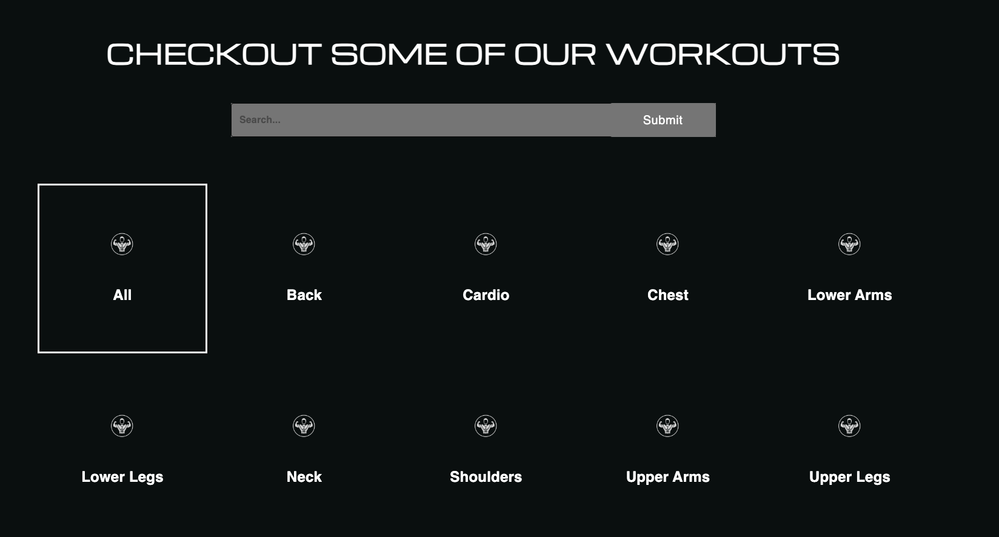
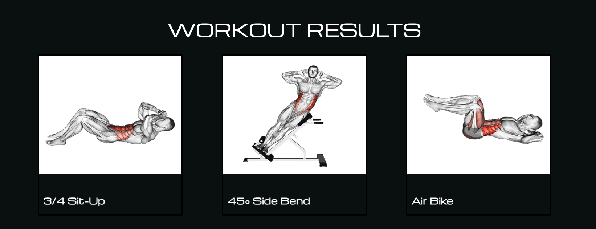
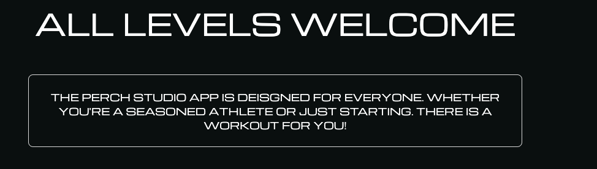

# PERCH STUDIO

## Technologies Used: 

JAVASCRIPT |
REACT |
MUI |
CSS |
HTML |
EXCERCISEDB RAPIDAPI |
CHATGPT |

## Getting Started

### Link: https://perchstudio.netlify.app/

### Planning Materials  

TRELLO BOARD: https://trello.com/b/pSwzEilj/project-3

## Next Steps

### Create a dedicated detail page for each exercise to provide users with more information and guidance.

Exercise Information: Display detailed information about each exercise, including proper form, benefits, and any precautions.
Video Demonstrations: Embed video demonstrations for each exercise to help users understand the correct execution.
User Ratings and Reviews: Allow users to rate and review exercises, providing valuable feedback to the community.

### Enable users to create accounts and save their workout routines for a personalized experience.

User Authentication: Implement a user authentication system to allow users to create accounts and log in securely.
Workout Logging: Allow users to create, edit, and save custom workout routines.
History Tracking: Enable a workout history feature so users can track their progress over time.

### Workout Reminders that help users stay consistent with their fitness routines by implementing a reminder system.

Customizable Reminders: Allow users to set reminders for specific workout times or days.
Push Notifications: Implement push notifications to remind users of upcoming workouts or provide motivational messages.

